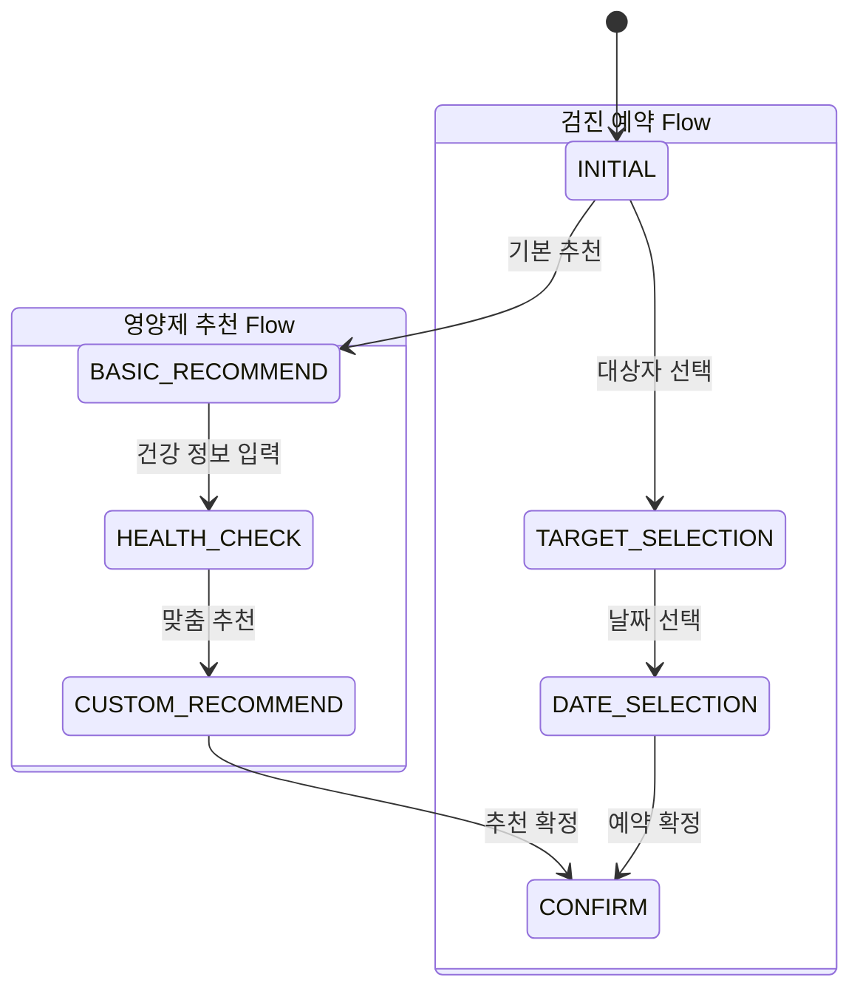
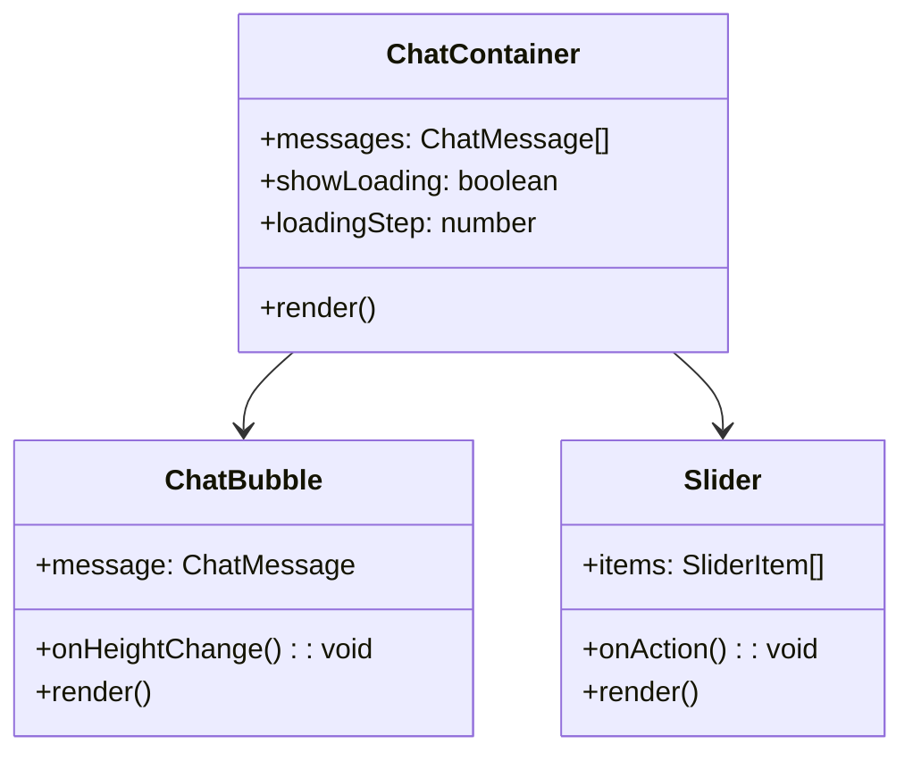
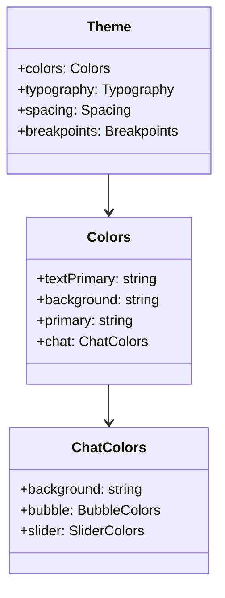
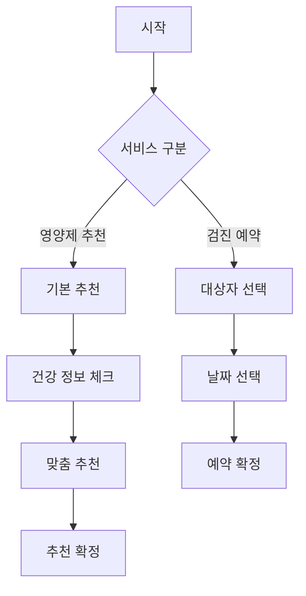
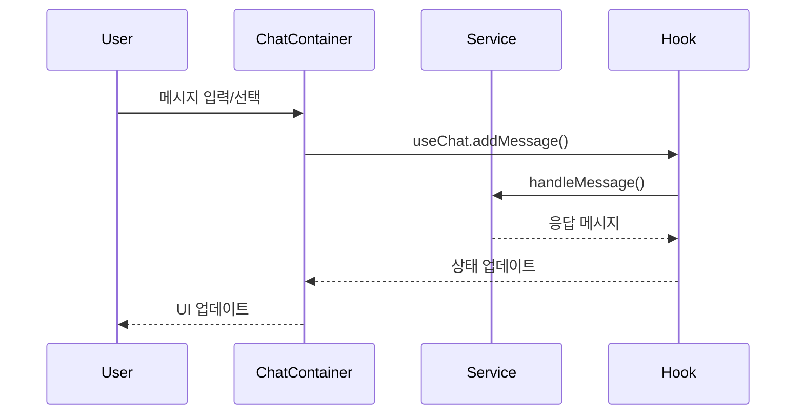

# 시스템 아키텍처 문서

## 1. 서비스 상태 흐름도

## 2. 컴포넌트 구조도

## 3. 테마 구조도

## 4. 비즈니스 로직 흐름도

## 5. 메시지 처리 흐름도

## 6. 서비스 구조 설명

### 6.1 공통 컴포넌트
- **ChatContainer**: 채팅 UI의 메인 컨테이너
- **ChatBubble**: 메시지 표시 컴포넌트
- **Slider**: 선택형 응답 UI 컴포넌트

### 6.2 서비스별 비즈니스 로직
#### Kindhabit (영양제 추천)
- `supplement.ts`: 영양제 추천 비즈니스 로직
- `supplement-main-chat.ts`: 채팅 인터페이스 로직

#### XOG (검진 예약)
- `book.ts`: 검진 예약 비즈니스 로직
- `book-main-chat.ts`: 채팅 인터페이스 로직

### 6.3 테마 시스템
- 서비스별 독립적인 테마 구성
- 공통 컴포넌트의 스타일 커스터마이징 지원
- 반응형 디자인을 위한 브레이크포인트 시스템 